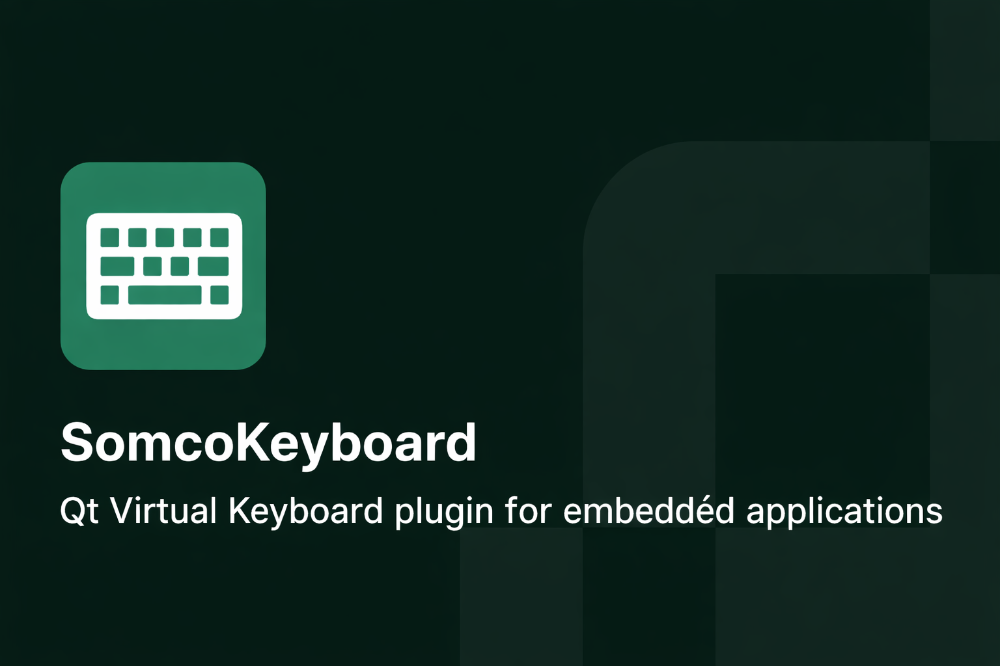
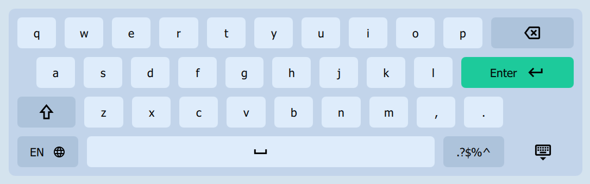
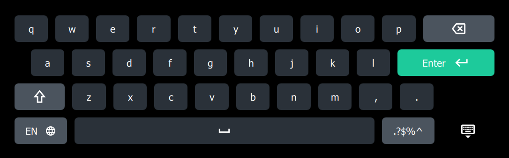

# 🎹 SomcoKeyboard

[](https://opensource.org/licenses/MIT)
[](https://qt.io)



**A versatile, QML-based virtual keyboard for embedded applications**

---

## Overview

SomcoKeyboard is a lightweight, production-ready on-screen virtual keyboard designed for embedded systems. Whether you're building touch interfaces for medical devices, industrial systems, or consumer products, SomcoKeyboard delivers a smooth typing experience with built-in theming, multi-language support, and seamless Qt integration.

✨ **Zero configuration needed** — just integrate and go. Comprehensive customization available for advanced use cases.

---

## ✨ Features

| Feature | Details |
|---------|---------|
| 🎨 **Built-in Themes** | Ready-to-use light and dark themes — no setup required |
| 🖌️ **Customizable Appearance** | Easily define and switch custom themes for your brand |
| 🌍 **Multi-Language Support** | 17+ keyboard layouts included (Latin, Cyrillic, Greek) |
| ⚡ **Embedded-Friendly** | Optimized for performance and minimal resource usage |
| 🔗 **Qt Integration** | Simple, seamless integration into Qt Quick projects |
| 📜 **Open Source** | MIT licensed — free to use, modify, and extend |

---

## 🚀 Quick Start

### Installation

1. **Add as a Git submodule:**
   ```bash
   git submodule add git@github.com:somcosoftware/somcokeyboard.git 3rdParty/SomcoKeyboard
   ```

2. **Include in your CMake:**
   ```cmake
   add_subdirectory(3rdParty/SomcoKeyboard)
   ```

3. **Set the input method in `main.cpp`:**
   ```cpp
   int main(int argc, char** argv) {
       qputenv("QT_IM_MODULE", QByteArray("somcokeyboard"));
       // ...
   }
   ```

4. **Use in QML:**
   ```qml
   import QtQuick.SomcoKeyboard 1.0

   ApplicationWindow {
       InputPanel {
           id: inputPanel
           z: 99
           y: Qt.inputMethod.visible ? (parent.height - height) : parent.height
           width: parent.width

            Behavior on y {
                NumberAnimation {
                    duration: 300
                    easing.type: Easing.InOutQuad
                }
            }
       }
   }
   ```

---

## 🎨 Themes

### Built-in Themes

SomcoKeyboard comes with two pre-configured themes:
- **`defaultLight`** — Light theme (default)

- **`defaultDark`** — Dark theme


No configuration needed — just use them!

### Switch Themes

```qml
InputPanel {
    themeName: "defaultDark"
}
```

### Create Custom Themes

Override built-in themes with your own:

```qml
InputPanel {
    themeName: "myTheme"
    themes: [
        KeyboardTheme {
            themeName: "myTheme"
            backgroundColor: "#222"
            btnBackgroundColor: "#333"
            btnTextColor: "#FFF"
            // ... other properties
        }
    ]
}
```

> ⚠️ **Note:** When custom themes are provided, default themes are not added automatically.

---

## 🌍 Supported Languages

| Language Name | Language Code | Layout File |
|---------------|---------------|--------------|
| Bosnian (Cyrillic) | CyBs | [`CySrBsLayout.qml`](src/qml/CySrBsLayout.qml) |
| Bosnian (Latin) | LtBs | [`LtSrHrBsLayout.qml`](src/qml/LtSrHrBsLayout.qml) |
| Croatian | Hr | [`LtSrHrBsLayout.qml`](src/qml/LtSrHrBsLayout.qml) |
| Czech | Cs | [`CsLayout.qml`](src/qml/CsLayout.qml) |
| Danish | Da | [`DaLayout.qml`](src/qml/DaLayout.qml) |
| Dutch | Nl | [`NlLayout.qml`](src/qml/NlLayout.qml) |
| English | En | [`EnLayout.qml`](src/qml/EnLayout.qml) |
| Finnish | Fi | [`FiLayout.qml`](src/qml/FiLayout.qml) |
| French | Fr | [`FrLayout.qml`](src/qml/FrLayout.qml) |
| German | De | [`DeLayout.qml`](src/qml/DeLayout.qml) |
| Greek | El | [`ElLayout.qml`](src/qml/ElLayout.qml) |
| Italian | It | [`ItLayout.qml`](src/qml/ItLayout.qml) |
| Polish | Pl | [`PlLayout.qml`](src/qml/PlLayout.qml) |
| Portuguese | Pt | [`PtLayout.qml`](src/qml/PtLayout.qml) |
| Russian | Ru | [`RuLayout.qml`](src/qml/RuLayout.qml) |
| Serbian (Cyrillic) | CySr | [`CySrBsLayout.qml`](src/qml/CySrBsLayout.qml) |
| Serbian (Latin) | LtSr | [`LtSrHrBsLayout.qml`](src/qml/LtSrHrBsLayout.qml) |
| Spanish | Es | [`EsLayout.qml`](src/qml/EsLayout.qml) |
| Swedish | Sv | [`SvLayout.qml`](src/qml/SvLayout.qml) |
| Turkish | Tr | [`TrLayout.qml`](src/qml/TrLayout.qml) |
| Ukrainian | Uk | [`UkLayout.qml`](src/qml/UkLayout.qml) |

**All layouts are extensible** — easily add or customize languages for your needs.

---

## ⚙️ Configuration

Customize keyboard behavior with simple QML properties:

```qml
InputPanel {
    availableLanguageLayouts: ["En", "De", "Uk"]
    languageLayout: "En"
    persistentShift: false
    autoCapitalize: true
}
```

---

## 🤝 Contributing

We love contributions! Here's how to get started:

1. **Fork** the repository
2. **Create** a feature branch: `git checkout -b feature/YourFeature`
3. **Commit** your changes: `git commit -m 'Add some feature'`
4. **Push** to the branch: `git push origin feature/YourFeature`
5. **Open** a Pull Request

Please follow standard Qt coding conventions.

### Ways to Contribute
- 🐛 Fix bugs
- 🌐 Add new keyboard layouts
- 📚 Improve documentation
- 🎨 Enhance UI/UX
- 💡 Suggest features

## About Somco Software (previously Scythe Studio)
[Somco Software (previously Scythe Studio)](https://somcosoftware.com/en/) is an embedded and cross-platform software development company with a strong focus on Qt and C++, delivering reliable, high-quality solutions for regulated industries, with particular expertise in medical devices. We are an ISO 9001 and ISO 13485 certified software house, specializing in GUI development, Linux-based systems, and advanced connectivity solutions. Somco Software is an official Qt Service Partner and a trusted partner of leading hardware manufacturers.

<table align="center" style="margin: 0 auto; border: none;">
    <tr style="border: none;">
        <td style="border: none;">
            <a href="https://somcosoftware.com/">
                
            </a>
        </td>
        <td style="border: none;">
            <a href="https://clutch.co/profile/somco-software">
                
            </a>
        </td>
        <td style="border: none;">
            <a href="https://somcosoftware.com/en/iso">
                
            </a>
        </td>
        <td style="border: none;">
            <a href="https://somcosoftware.com/en/iso">
                
            </a>
        </td>
    </tr>
</table>

We support projects from design to delivery, offering UX/UI design, custom Yocto Linux images, and development in Qt as well as LVGL and TouchGFX. We also help with software modernization, training, and technical consulting. With a practical, developer-focused approach, we build efficient, reliable solutions that fit real project needs.

## Professional Support
Need help with anything? We’ve got you covered. Our professional support services are here to assist you with. For more details about support options and pricing, just drop us a line at https://somcosoftware.com/en/contact.

## Follow Us
Stay updated on the latest in Qt and QML development:
- 🌐 [Somco Software Website](https://somcosoftware.com/en/)
- ✍️ [Somco Software Blog](https://somcosoftware.com/en/blog)
- 👔 [Somco Software LinkedIn](https://www.linkedin.com/company/somcosoftware)
- 🎥 [Somco Software YouTube](https://www.youtube.com/channel/UCf4OHosddUYcfmLuGU9e-SQ/featured)

## Authors
- **Uwe Kindler** - Initial work - [githubuser0xFFFF](https://github.com/githubuser0xFFFF)
- **Andrea Ricchi** - CuteKeyboard inspiration - [AndreaRicchi](https://github.com/AndreaRicchi) (from [amarula/cutekeyboard](https://github.com/amarula/cutekeyboard))
- **Oleksandr Movchan** - Somco Software contributions - [SomcoSoftware](https://github.com/somcosoftware)
